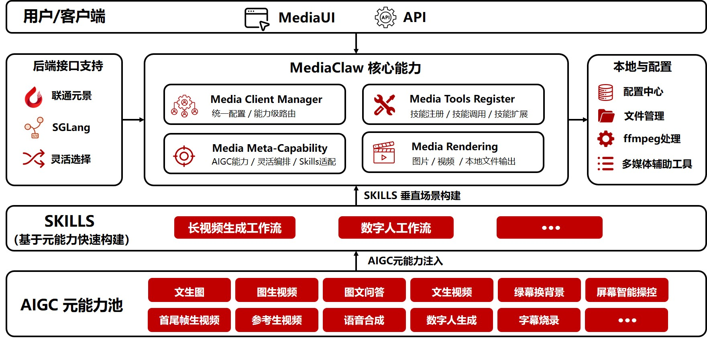

# MediaClaw

<div align="center">
  
  <h3>多模态智能体平台</h3>
  <p>聚合全品类AIGC元能力，快速搭建适配场景的多媒体生成方案</p>

[](LICENSE)
[](https://github.com/openclaw/openclaw.git)
[]()
[]()

<p align="center">
    简体中文 |
    <a href="./README.md">English</a> 
</p>

</div>

## 🚀 项目简介

MediaClaw是联通UnicomAI（联通元景大模型团队）基于 [OpenClaw](https://github.com/openclaw/openclaw ) 生态开发的多模态智能体平台，通过聚合图文生成、视频创作、语音合成、数字人、后期特效等全品类AIGC元能力，形成可统一调用、灵活组合的工具集，专门用于支撑各类垂直任务的Skill定制。我们定制了专门的人机交互接口（HMI），并通过统一MediaUI对外开放，帮助业务团队、开发者和生态伙伴快速搭建真正适配场景的多媒体生成方案，简化操作、降本提效。

<div align="center">
  
  <p><em>MediaClaw 整体架构图</em></p>
</div>

## ✨ 核心特性

- 🎨 **全栈AIGC能力**：覆盖图文、视频、语音、数字人等全品类多媒体生成能力
- 🔌 **插件化架构**：基于OpenClaw生态开发，无缝集成到现有OpenClaw部署
- 🎯 **多提供商支持**：同时支持元景（YuanJing）和SGLang双后端提供商，并将逐步引入其他闭源模型
- ⚙️ **灵活配置**：支持按能力维度配置不同提供商和模型选项
- 🛠️ **开箱即用**：提供完善的WebUI界面，无需复杂开发即可快速上手
- 🔧 **技能扩展**：支持自定义Skill开发，快速适配垂直场景需求
- 🎬 **后期处理**：内置字幕烧录、绿幕抠图等本地视频处理能力

## 📊 能力矩阵

| 功能 | 后端依赖 | 元景 (YuanJing) | SGLang | 工具名 |
|------|----------|:---------------:|:------:|--------|
| 文生图 | 需要 | ✅ | ✅ | `mediaclaw_text_to_image` |
| 图文问答 | 需要 | ✅ | ✅ | `mediaclaw_image_qa` |
| 文生视频 | 需要 | ✅ (Wan/Kling) | ✅ | `mediaclaw_text_to_video` |
| 单图生视频 | 需要 | ✅ (Wan风格化/Kling单图) | ✅ | `mediaclaw_image_to_video` |
| 多图/首尾帧生视频 | 需要 | ✅ (Wan多图/Kling首尾帧) | ❌ | `mediaclaw_images_to_video` |
| 文生语音 | 需要 | ✅ | ❌ | `mediaclaw_text_to_speech` |
| 数字人视频 | 需要 | ✅ | ❌ | `mediaclaw_digital_avatar` |
| 字幕烧录 | 不需要（本地 ffmpeg） | N/A | N/A | `mediaclaw_burn_subtitles` |
| 绿幕换背景 | 不需要（本地 ffmpeg） | N/A | N/A | `mediaclaw_replace_background` |
| 本地图片/视频 | 不需要（本地处理） | N/A | N/A | `mediaclaw_local_image` |

## 📦 安装指南

### 环境要求

- Node.js 22+
- OpenClaw Gateway >= 2026.3.24-beta.2
- 使用 `mediaclaw_burn_subtitles` / `mediaclaw_replace_background` 需安装 `ffmpeg`

### 插件安装

```bash
# 安装MediaClaw插件
openclaw plugins install ./mediaclaw-plugin --force

# 重启OpenClaw网关
openclaw gateway restart
```

### WebUI 安装

WebUI 基于 [OpenClaw-Admin](https://github.com/itq5/OpenClaw-Admin) 定制开发：

```bash
# 进入OpenClaw-Admin目录
cd OpenClaw-Admin

# 安装依赖
npm install

# 启动开发服务
npm run dev:all
```

安装完成后，访问 `http://localhost:3001/` 即可使用。

## ⚙️ 配置说明

### 基础配置

编辑 `openclaw.json` 配置文件，在 `plugins` 节点中新增 MediaClaw 相关配置：

```json
"plugins": {
    "mediaclaw": {
      "enabled": true,
      "config": {
        "providers": {
          "yuanjing": {
            "apiKey": "your-yuanjing-token",
            "baseUrl": "https://maas-api.ai-yuanjing.com"
          },
          "sglang": {
            "baseUrl": "http://sglang-default:30010",
            "apiKey": "default-key"
          }
        },
        "capabilities": {
          "textToVideo": {
            "provider": "yuanjing"
          }
        },
        "defaultProvider": "yuanjing"
      }
    },
  },
```

**配置说明：**
- 默认使用元景（YuanJing）作为默认提供商（`defaultProvider: "yuanjing"`）
- `providers` 节点为全局提供商配置
- `capabilities.<name>.provider` 可单独为每个能力指定提供商，覆盖全局配置

### 视频模型配置

元景MaaS平台已接入可灵（Kling）服务，支持在元景提供商下选择使用 Wan 或 Kling 模型。

**简化配置（仅指定模型）：**
```json
{
  "providers": {
    "yuanjing": { "apiKey": "your-yuanjing-key" }
  },
  "capabilities": {
    "textToVideo": { "videoModel": "kling" },
    "imageToVideo": { "videoModel": "kling" },
    "imagesToVideo": { "videoModel": "kling" }
  }
}
```

**完整配置（指定提供商和模型）：**
```json
{
  "providers": {
    "yuanjing": { "apiKey": "your-yuanjing-key" }
  },
  "capabilities": {
    "textToVideo": {
      "provider": "yuanjing",
      "videoModel": "kling"
    },
    "imageToVideo": {
      "provider": "yuanjing",
      "videoModel": "kling"
    },
    "imagesToVideo": {
      "provider": "yuanjing",
      "videoModel": "kling"
    }
  }
}
```

**视频模型选项：**
- `wan` - Wan 2.2 模型（默认）
- `kling` - Kling V3 模型（高品质视频）

**能力说明：**
- `image_to_video`：单图生视频（支持Wan风格化或Kling单图生成）
- `images_to_video`：多图/首尾帧生视频（支持Wan多图或Kling首尾帧生成）

### 配置参数详解

| 参数 | 说明 |
|------|------|
| `providers.yuanjing.apiKey` | 元景 API Key（必填） |
| `providers.yuanjing.baseUrl` | 元景 API 服务地址 |
| `providers.sglang.baseUrl` | SGLang 服务地址 |
| `providers.sglang.apiKey` | SGLang API Key |
| `providers.sglang.apiPath` | API 路径前缀 |
| `capabilities` | 能力配置节点，支持：`textToImage`、`textToVideo`、`imageToVideo`、`imagesToVideo`、`imageQA`、`textToSpeech`、`digitalAvatar` |
| `capabilities.<name>.videoModel` | 元景提供商下指定视频模型：`wan` 或 `kling` |
| `defaultProvider` | 未单独配置的能力使用的默认提供商 |
| `outputDir` | 生成文件的输出目录 |
| `videoPollInterval` | 视频生成轮询间隔(ms)，默认 5000 |
| `videoMaxWaitTime` | 视频生成最大等待时间(ms)，默认 300000 |

## 🔍 SGLang Vision 配置

`mediaclaw_image_qa` 能力在 `sglang` 模式下使用 OpenAI 兼容的 Vision 接口：

- 接口地址：`POST /chat/completions`

支持两类路径格式：
- `/v1/chat/completions`
- `/openapi/v1/web_control/chat/completions`

**配置建议：**
- 如果 `baseUrl` 已包含 `/openapi/v1/web_control`，则 `apiPath` 设为空字符串
- 如果 `baseUrl` 仅为主机地址（如 `http://127.0.0.1:30010`），则 `apiPath` 设为 `/v1`

## 🛠️ 内置技能

### 长视频生成
- 详细说明：`skills/unicom-longvideo/SKILL.md`


https://github.com/user-attachments/assets/d6e26691-6391-4e40-8c7c-1209e90fe9b1


### 数字人制作
- 详细说明：`skills/unicom-digital-avatar/SKILL.md`


https://github.com/user-attachments/assets/cfd28a76-4958-4225-ae0b-096d61745585


## 🙏 致谢

MediaClaw 的开发离不开开源社区的支持，我们在此特别感谢：
- [OpenClaw](https://github.com/itq5/OpenClaw) - 提供了强大的插件化网关平台和生态支持，是MediaClaw的运行基础
- [OpenClaw-Admin](https://github.com/itq5/OpenClaw-Admin) - 提供了优秀的管理界面框架，我们在此基础上进行了AIGC能力的定制扩展
- 所有为开源项目做出贡献的开发者们

## 📄 许可证

MediaClaw 采用 [MIT 许可证](LICENSE) 开源，您可以自由使用、修改和分发，但请保留相关版权声明和致谢信息。

---

<div align="center">
  <strong>如果这个项目对您有帮助，请给我们一个 ⭐️ Star 支持！</strong>
</div>
