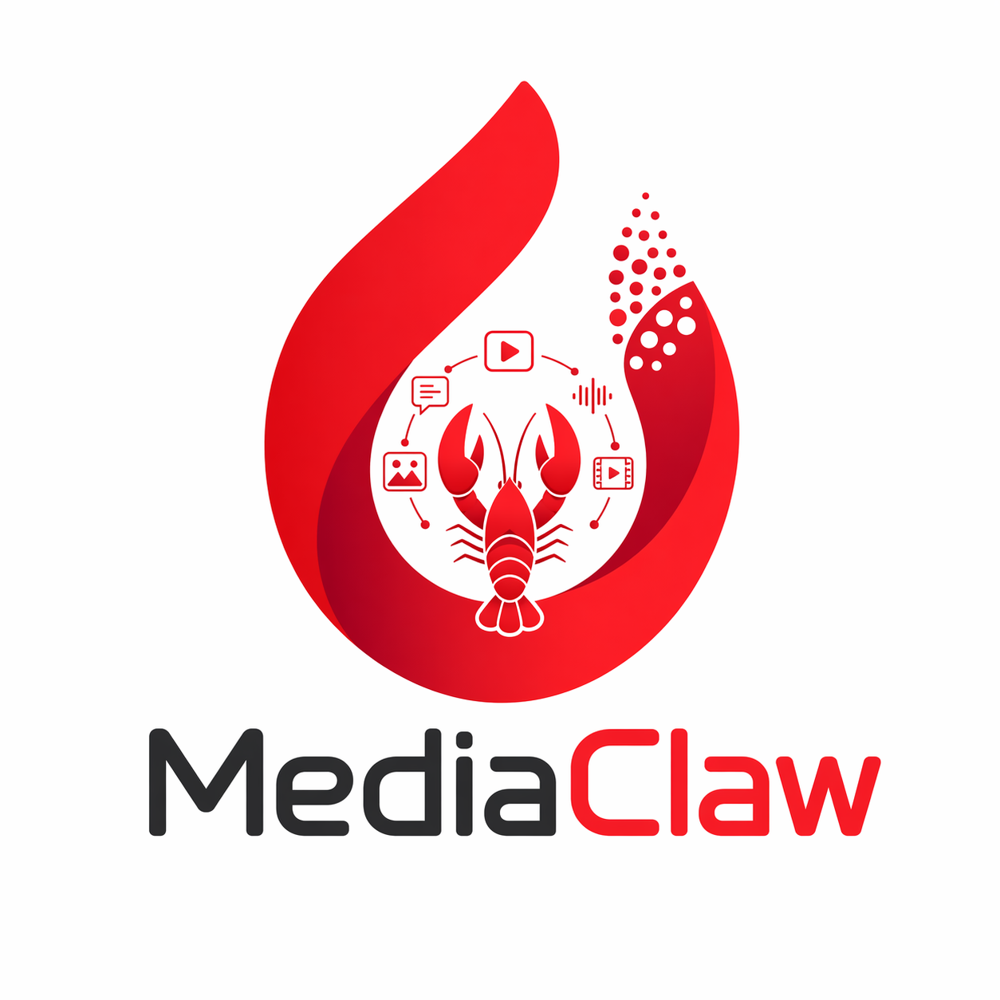
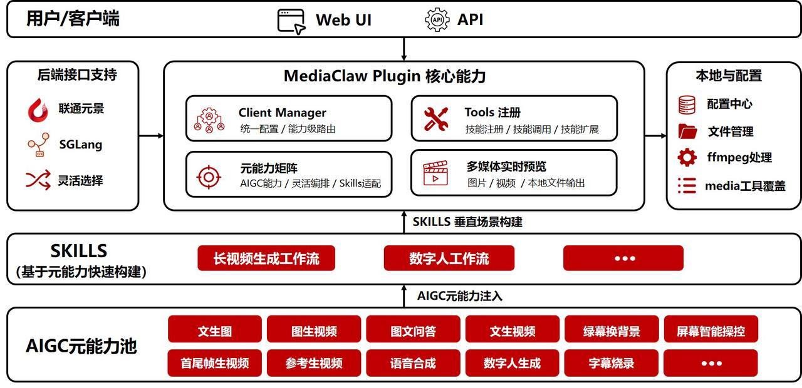

# MediaClaw

<div align="center">
  
  <h3>Multimodal Agent Platform</h3>
  <p>Aggregate full-stack AIGC capabilities to quickly build scenario-adapted multimedia generation solutions</p>

[](LICENSE)
[](https://github.com/openclaw/openclaw.git)
[]()
[]()
[](README.md)

</div>

## 🚀 Project Introduction

MediaClaw is a multimodal agent platform developed based on the [OpenClaw](https://github.com/itq5/OpenClaw) ecosystem. By aggregating full-category AIGC meta-capabilities including image generation, video creation, speech synthesis, digital human, and post-production effects, it forms a unified and flexible toolset (meta-capability pool) that can be called uniformly and combined flexibly.

We have customized the interface and extended functions based on [OpenClaw-Admin](https://github.com/itq5/OpenClaw-Admin), and opened it to the public through a unified AIGC UI. It is specially designed to support Skill customization for various vertical tasks, helping business teams, developers, and ecological partners quickly build multimedia generation solutions that truly adapt to scenarios, simplifying operations, reducing costs and improving efficiency.

<div align="center">
  
  <p><em>MediaClaw Overall Architecture Diagram</em></p>
</div>

## ✨ Core Features

- 🎨 **Full-stack AIGC Capabilities**: Covering full-category multimedia generation capabilities including images, videos, speech, and digital humans
- 🔌 **Plugin Architecture**: Developed based on OpenClaw ecosystem, seamlessly integrated into existing OpenClaw deployments
- 🎯 **Multi-provider Support**: Support both YuanJing and SGLang backend providers
- ⚙️ **Flexible Configuration**: Support configuring different providers and model options by capability dimension
- 🛠️ **Out-of-the-box**: Provides a complete WebUI interface, ready to use without complex development
- 🔧 **Skill Extension**: Support custom Skill development to quickly adapt to vertical scenario requirements
- 🎬 **Post-processing**: Built-in local video processing capabilities such as subtitle burning and green screen matting

## 📊 Capability Matrix

| Feature | Backend Dependency | YuanJing | SGLang | Tool Name |
|---------|---------------------|:--------:|:------:|-----------|
| Text to Image | Required | ✅ | ✅ | `mediaclaw_text_to_image` |
| Image QA | Required | ✅ | ✅ | `mediaclaw_image_qa` |
| Text to Video | Required | ✅ (Wan/Kling) | ✅ | `mediaclaw_text_to_video` |
| Image to Video | Required | ✅ (Wan Stylization/Kling Single Image) | ✅ | `mediaclaw_image_to_video` |
| Multiple Images to Video | Required | ✅ (Wan Multi-image/Kling First-last Frame) | ❌ | `mediaclaw_images_to_video` |
| Text to Speech | Required | ✅ | ❌ | `mediaclaw_text_to_speech` |
| Digital Avatar Video | Required | ✅ | ❌ | `mediaclaw_digital_avatar` |
| Subtitle Burning | No required (local ffmpeg) | N/A | N/A | `mediaclaw_burn_subtitles` |
| Green Screen Background Replacement | No required (local ffmpeg) | N/A | N/A | `mediaclaw_replace_background` |
| Local Image/Video Processing | No required (local processing) | N/A | N/A | `mediaclaw_local_image` |

## 📦 Installation Guide

### Environment Requirements

- Node.js 22+
- OpenClaw Gateway >= 2026.3.24-beta.2
- `ffmpeg` is required for using `mediaclaw_burn_subtitles` / `mediaclaw_replace_background`

### Plugin Installation

```bash
# Install MediaClaw plugin
openclaw plugins install ./mediaclaw-plugin --force

# Restart OpenClaw gateway
openclaw gateway restart
```

### WebUI Installation

WebUI is customized based on [OpenClaw-Admin](https://github.com/itq5/OpenClaw-Admin):

```bash
# Enter OpenClaw-Admin directory
cd OpenClaw-Admin

# Install dependencies
npm install

# Start development server
npm run dev:all
```

After installation, visit `http://localhost:3001/` to use.

## ⚙️ Configuration Guide

### Basic Configuration

Edit the `openclaw.json` configuration file and add MediaClaw related configuration in the `plugins` node:

```json
"plugins": {
    "mediaclaw": {
      "enabled": true,
      "config": {
        "providers": {
          "yuanjing": {
            "apiKey": "your-yuanjing-token",
            "baseUrl": "https://maas-api.ai-yuanjing.com"
          },
          "sglang": {
            "baseUrl": "http://sglang-default:30010",
            "apiKey": "default-key"
          }
        },
        "capabilities": {
          "textToVideo": {
            "provider": "yuanjing"
          }
        },
        "defaultProvider": "yuanjing"
      }
    },
  },
```

**Configuration Description:**
- YuanJing is used as the default provider by default (`defaultProvider: "yuanjing"`)
- The `providers` node is the global provider configuration
- `capabilities.<name>.provider` can specify a provider for each capability individually, overriding the global configuration

### Video Model Configuration

YuanJing MaaS platform has integrated Kling services, supporting the selection of Wan or Kling models under the YuanJing provider.

**Simplified Configuration (Model Only):**
```json
{
  "providers": {
    "yuanjing": { "apiKey": "your-yuanjing-key" }
  },
  "capabilities": {
    "textToVideo": { "videoModel": "kling" },
    "imageToVideo": { "videoModel": "kling" },
    "imagesToVideo": { "videoModel": "kling" }
  }
}
```

**Full Configuration (Provider and Model):**
```json
{
  "providers": {
    "yuanjing": { "apiKey": "your-yuanjing-key" }
  },
  "capabilities": {
    "textToVideo": {
      "provider": "yuanjing",
      "videoModel": "kling"
    },
    "imageToVideo": {
      "provider": "yuanjing",
      "videoModel": "kling"
    },
    "imagesToVideo": {
      "provider": "yuanjing",
      "videoModel": "kling"
    }
  }
}
```

**Video Model Options:**
- `wan` - Wan 2.2 Model (Default)
- `kling` - Kling V3 Model (High-quality Video)

**Capability Description:**
- `image_to_video`: Single image to video (supports Wan stylization or Kling single image generation)
- `images_to_video`: Multiple images/first-last frame to video (supports Wan multi-image or Kling first-last frame generation)

### Configuration Parameter Details

| Parameter | Description |
|-----------|-------------|
| `providers.yuanjing.apiKey` | YuanJing API Key (Required) |
| `providers.yuanjing.baseUrl` | YuanJing API service address |
| `providers.sglang.baseUrl` | SGLang service address |
| `providers.sglang.apiKey` | SGLang API Key |
| `providers.sglang.apiPath` | API path prefix |
| `capabilities` | Capability configuration node, supports: `textToImage`, `textToVideo`, `imageToVideo`, `imagesToVideo`, `imageQA`, `textToSpeech`, `digitalAvatar` |
| `capabilities.<name>.videoModel` | Specify video model under YuanJing provider: `wan` or `kling` |
| `defaultProvider` | Default provider for capabilities not individually configured |
| `outputDir` | Output directory for generated files |
| `videoPollInterval` | Video generation polling interval (ms), default 5000 |
| `videoMaxWaitTime` | Maximum waiting time for video generation (ms), default 300000 |

## 🔍 SGLang Vision Configuration

The `mediaclaw_image_qa` capability uses the OpenAI compatible Vision interface in `sglang` mode:

- Interface address: `POST /chat/completions`

Supports two path formats:
- `/v1/chat/completions`
- `/openapi/v1/web_control/chat/completions`

**Configuration Suggestions:**
- If `baseUrl` already includes `/openapi/v1/web_control`, set `apiPath` to an empty string
- If `baseUrl` is only the host address (e.g., `http://127.0.0.1:30010`), set `apiPath` to `/v1`

## 🛠️ Built-in Skills

### Long Video Generation
- Detailed description: `skills/unicom-longvideo/SKILL.md`

### Digital Avatar Production
- Detailed description: `skills/unicom-digital-avatar/SKILL.md`

## 🙏 Acknowledgments

The development of MediaClaw is inseparable from the support of the open source community. We would like to express our special thanks to:

- [OpenClaw](https://github.com/itq5/OpenClaw) - Provides a powerful plugin gateway platform and ecological support, which is the operating foundation of MediaClaw
- [OpenClaw-Admin](https://github.com/itq5/OpenClaw-Admin) - Provides an excellent management interface framework, based on which we have customized and extended AIGC capabilities
- All developers who contribute to open source projects

## 📄 License

MediaClaw is open sourced under the [MIT License](LICENSE). You are free to use, modify and distribute it, but please retain the relevant copyright notice and acknowledgment information.

---

<div align="center">
  <strong>If this project is helpful to you, please give us a ⭐️ Star to support!</strong>
</div>
